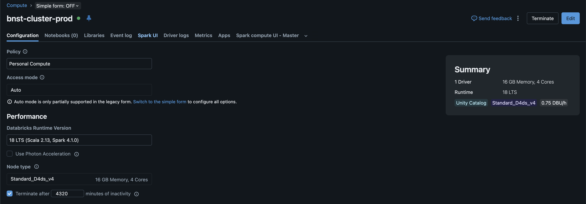
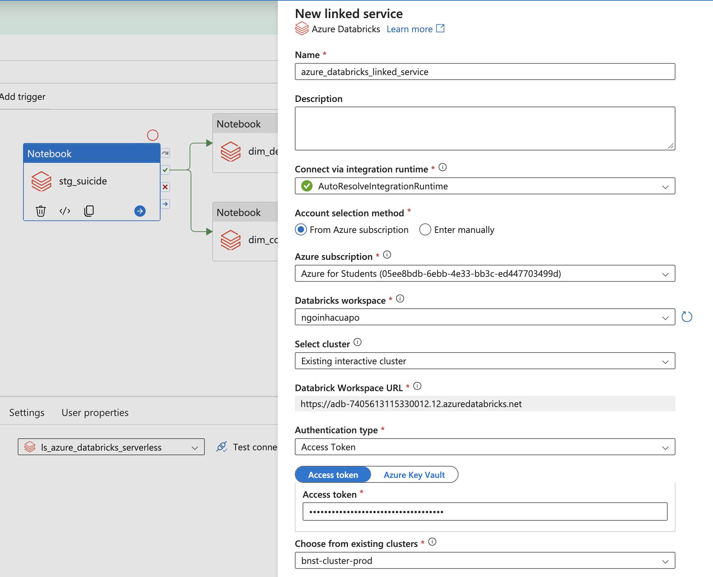
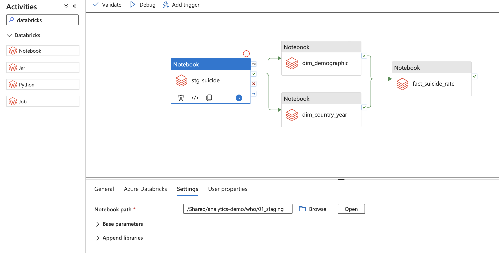
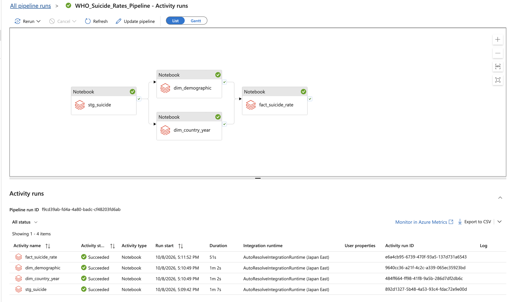

# Azure Databricks analyst bootcamp

[](https://azure.microsoft.com/products/databricks)
[](https://databricks.com)
[](https://spark.apache.org/)
[](https://www.python.org/)

**Azure Storage → Azure Databricks → Delta tables → Power BI**, with Azure Data Factory (ADF) Studio orchestrating notebook runs.

Students run PySpark online in Databricks. Local Python automates Azure infrastructure, Unity Catalog storage setup, and notebook upload. ADF linked services and pipelines are created in the ADF Studio interface.


## 1. Prepare your computer and Azure access

Install [uv](https://docs.astral.sh/uv/getting-started/installation/) and the [Azure CLI](https://learn.microsoft.com/cli/azure/install-azure-cli). Follow [Azure setup](AZURE.md) to sign in, prepare deployment credentials, create or select an Azure Databricks workspace, and fill in `.env`.

From the repository root, install the project tools and create the environment file:

```bash
uv sync --locked
cp .env.example .env
```

If `.env` already exists, keep it and update only the needed values. Configure `AZURE_SUBSCRIPTION_ID`, `AZURE_TENANT_ID`, `AZURE_CLIENT_ID`, `AZURE_CLIENT_SECRET`, `RESOURCE_GROUP`, `AZURE_LOCATION`, `STORAGE_ACCOUNT`, `DATA_FACTORY`, `DATABRICKS_HOST`, `DATABRICKS_TOKEN`, and `DATABRICKS_CATALOG`. The workspace URL should look like `https://adb-....azuredatabricks.net`.

## 2. Provision Azure resources and upload notebooks

Run setup from the repository root:

```bash
uv run solution setup
```

Setup provisions ADLS Gen2 with `raw`, `lakehouse`, and `reports` containers; an Access Connector with storage permissions; Unity Catalog storage credentials, external locations, and `dm_sales` / `dm_who` schemas; Azure Data Factory; and the course notebooks uploaded under `/Shared/analytics-demo` by default. It also uploads the sales fixture to `raw/sales/sales.csv`.

Setup does not create ADF linked services, pipelines, or Databricks jobs. You will create an interactive cluster, linked service, and pipeline in their respective user interfaces in the next steps. Storage access uses the Access Connector managed identity; the Databricks token is used to authenticate notebook upload and ADF workspace access.

For an existing deployment, `uv run solution provision` applies Terraform and `uv run solution deploy` configures storage and uploads notebooks. Run `uv run solution setup` for both operations. Keep Terraform state and resource names; import any existing resources that are not in this Terraform state before provisioning.

## 3. Create an all-purpose cluster in Databricks

1. Open your Azure Databricks workspace and select **Compute**.
2. Select **Create compute**. Name the cluster `adf-course-cluster`.
3. Choose an available Databricks Runtime and a small node type. Set auto-termination to stop the cluster after it is idle.
4. Select **Create compute** and wait until the cluster is **Running**.



ADF will connect to this existing interactive cluster. If cluster creation is restricted in your workspace, ask your administrator which all-purpose cluster to use.

## 4. Create a Databricks access token

ADF uses a Databricks access token to connect to the workspace.

1. In Databricks, select your user icon, then **Settings**.
2. Open **Developer** and select **Manage** beside **Access tokens**.
3. Select **Generate new token**, enter `Azure Data Factory` as the description, and set an expiry.
4. Generate the token and copy it immediately. Keep it private; you will paste it into ADF.

If token creation is disabled, ask your workspace administrator to enable it or provide the approved authentication method for the course.

## 5. Create the Azure Databricks linked service in ADF

1. Open your Data Factory in the Azure portal and select **Launch Studio**.
2. In ADF Studio, select **Manage** (toolbox icon), then **Linked services**.
3. Select **+ New**, search for **Azure Databricks**, and select **Continue**.
4. Enter the name `ls_azure_databricks`.
5. Keep `AutoResolveIntegrationRuntime` unless your instructor specified another integration runtime.
6. Choose **From Azure subscription**, then select your subscription and Databricks workspace. If it is not listed, choose **Enter manually** and provide the workspace URL.
7. For **Select cluster**, choose **Existing interactive cluster**, then select `adf-course-cluster`.
8. Set **Authentication type** to **Access Token** and paste the token from Step 4.
9. Select **Test connection**. When it succeeds, select **Create**.



The example screenshot masks the token. Never include an actual token in screenshots, notebooks, or source control.

## 6. Create a pipeline and add notebook activities

1. In ADF Studio, select **Author** (pencil icon).
2. In **Factory Resources**, select **+** and then **Pipeline**. Name it `WHO_Suicide_Rates_Pipeline`.
3. Search the **Activities** pane for `Databricks`, then drag a **Notebook** activity onto the canvas.
4. Rename the activity `stg_suicide`. Select it, open **Azure Databricks**, and choose `ls_azure_databricks`.
5. Open **Settings** and enter `/Shared/analytics-demo/who/01_staging` as the notebook path.



Add three more Notebook activities with the same linked service and these names and paths:

| Activity name | Notebook path |
|---|---|
| `dim_country_year` | `/Shared/analytics-demo/who/02_dim_country_year` |
| `dim_demographic` | `/Shared/analytics-demo/who/03_dim_demographic` |
| `fact_suicide_rate` | `/Shared/analytics-demo/who/04_fact_suicide_rate` |

If you changed `DATABRICKS_NOTEBOOK_PATH` before setup, replace `/Shared/analytics-demo` in each path with your selected folder. Use **Browse** to select each notebook from the workspace.

## 7. Connect the activities and run the pipeline

Connect the green **Succeeded** output from `stg_suicide` to both dimension activities. Then connect the green **Succeeded** output from each dimension activity to `fact_suicide_rate`. This runs staging first, the two dimensions in parallel, then the fact table.



1. Select **Validate** and fix any configuration errors.
2. Select **Debug** and wait for the run to finish. Confirm all four activities succeeded.
3. Select **Publish all** to save the pipeline.
4. To run it again, select **Add trigger** → **Trigger now**. To schedule runs, create a schedule trigger and publish it.
5. Use **Monitor** to view pipeline and activity results. Open a failed activity for its error details and check the related notebook run in Databricks.

Validation checks pipeline configuration; Debug executes the notebook code. ADF Notebook activities use the interactive cluster selected in the linked service.

## 8. Check storage permissions and run the notebooks directly

The Databricks identity executing a notebook needs Unity Catalog permissions on the catalog, schemas, tables, and external locations. The token owner used by setup may already have the required grants; other students may need `USE CATALOG`, `USE SCHEMA`, table permissions, and the appropriate external-location permissions from a workspace administrator. Storage firewalls must allow Databricks access.

You can also open a deployed notebook in Databricks and select **Run all**. The course notebooks use hard-coded paths and table names; edit their location cells directly when your storage account or catalog differs from the example.

For the transformations and table design, see the [WHO worked demo](DEMO.md). For Power BI loading instructions, see [Power BI business report](powerbi-business-report/README.md).

## 9. Load the sales Parquet output into Power BI

The sales notebook writes Parquet part files under `reports/sales/`. In Power BI Desktop, select **Get data** → **Azure Blob Storage**, enter your storage account, and sign in with the storage account key from Azure Portal (**Security + networking** → **Access keys**), not the Databricks token.


Select the `reports` container and choose **Transform Data**. Spark also writes metadata files, so keep only `.parquet` part files.


In **Advanced Editor**, replace `<storage-account>` and rename the query `SalesReport`:

```powerquery
let
    Source = AzureStorage.Blobs("https://<storage-account>.blob.core.windows.net/"),
    Reports = Source{[Name="reports"]}[Data],
    SalesFiles = Table.SelectRows(Reports, each Text.StartsWith([Name], "sales/") and [Extension] = ".parquet"),
    ReadParquet = Table.AddColumn(SalesFiles, "Table", each Parquet.Document([Content])),
    Combined = Table.Combine(ReadParquet[Table])
in
    Combined
```


More report steps: [Power BI business report](powerbi-business-report/README.md).

## 10. Validate the repository and clean up Azure resources

Run the repository checks when making code changes:

```bash
uv run prek run --all-files
uv run pytest
```

To delete the Azure resource group and its contents:

```bash
uv run solution cleanup --confirm-resource-group YOUR_RESOURCE_GROUP
```

Cleanup also deletes an Azure Databricks workspace if it is in that resource group. Databricks notebooks and Unity Catalog metadata are separate and remain until removed explicitly.

## Repository map

| Folder | Purpose |
|---|---|
| `azure-terraform-provisioner/` | Terraform and Python provisioning |
| `azure-data-factory-pipeline/images/` | Screenshots used by the ADF setup guide in this README |
| `databricks-etl-pipeline/src/notebooks/` | Teaching notebooks and shared notebook utilities |
| `powerbi-business-report/` | Reporting notes |

[Azure setup details](AZURE.md) · [WHO worked demo](DEMO.md) · [ADF Notebook activity docs](https://learn.microsoft.com/en-us/azure/data-factory/transform-data-databricks-notebook) · [Managed identity storage access](https://learn.microsoft.com/en-us/azure/databricks/connect/unity-catalog/cloud-storage/azure-managed-identities)
