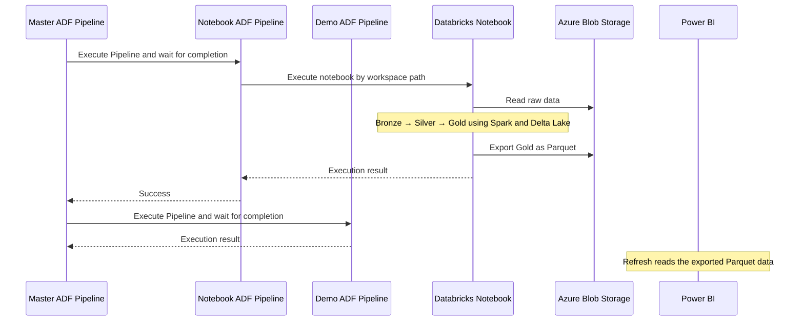

# azure-databricks-analyst-bootcamp

> A hands-on Medallion-architecture bootcamp repo that takes Data Analysts from raw Azure Blob data to Power BI dashboards, using Databricks Spark, Delta Lake, and Azure Data Factory.

---

## Table of Contents

- [azure-databricks-analyst-bootcamp](#azure-databricks-analyst-bootcamp)
  - [Table of Contents](#table-of-contents)
  - [Overview](#overview)
  - [Architecture](#architecture)
  - [Orchestration Flow](#orchestration-flow)
  - [Tech Stack](#tech-stack)
  - [Setup and Run from Your Local Machine](#setup-and-run-from-your-local-machine)
    - [1. Prepare the environment](#1-prepare-the-environment)
    - [2. Configure `.env`](#2-configure-env)
    - [3. Provision and deploy](#3-provision-and-deploy)
    - [4. Execute online](#4-execute-online)
    - [5. Format and check deployment code](#5-format-and-check-deployment-code)
    - [6. Clean up Azure resources](#6-clean-up-azure-resources)

---

## Overview

This repository is an end-to-end analytics example for Data Analysts learning the Azure + Databricks ecosystem.

**Pipeline in one sentence:** raw files land in **Azure Blob Storage**, get transformed through a **Bronze → Silver → Gold** Medallion architecture on **Databricks (Spark, Delta Lake)**, the whole thing is orchestrated by **Azure Data Factory (ADF)**, and the Gold layer is exported back to **Blob Storage as Parquet** for **Power BI** to consume as the final BI layer.

Students develop, execute, and test notebooks **online in the Databricks workspace**. Local Python commands handle infrastructure setup and deployment.

---

## Architecture


| Folder | Responsibility |
|---|---|
| `azure-terraform-provisioner/` | Azure infrastructure managed by Terraform and automated through Python |
| `azure-data-factory-pipeline/` | Complete Python pipeline definitions in `src/adf/defs/` (one file per pipeline), with shared connection and deployment helpers |
| `databricks-etl-pipeline/` | Dummy source data, SQL-based PySpark notebooks and shared write utilities under `src/notebooks/` |
| `powerbi-business-report/` | Power BI reporting layer consuming the exported Parquet data |

See [adding pipeline definitions](azure-data-factory-pipeline/README.md) for the import-and-register workflow.

---

## Orchestration Flow



---

## Tech Stack

| Concern | Technology |
|---|---|
| Infrastructure | Azure resources provisioned with Terraform through Python |
| Source storage | Azure Blob Storage / ADLS Gen2 |
| Compute / transform | Azure Databricks (PySpark notebooks) |
| Storage format | Delta Lake (Bronze/Silver/Gold) |
| Orchestration | Azure Data Factory, configured with Python |
| BI export format | Parquet (Blob Storage) |
| BI / reporting | Power BI |
| Configuration | Essential inputs in root `.env`; defaults in `config.py` |
| Formatting | Prek and Ruff, configured at the repository root |
| CI | GitHub Actions |

---

## Setup and Run from Your Local Machine

### 1. Prepare the environment

Install **Python 3.12** and **[uv](https://docs.astral.sh/uv/getting-started/installation/)**. From the repository root:

```bash
uv sync --locked
cp .env.example .env
```

On PowerShell, use `Copy-Item .env.example .env`. Preserve an existing `.env` when updating the repository.

Spark and Delta Lake run in Databricks; local Java and Spark installations are not required. Terraform is downloaded and verified automatically by the provisioning command.

### 2. Configure `.env`

Use [.env.example](.env.example) as the configuration reference. Fill in these required values:

| Variable | Description |
|---|---|
| `AZURE_SUBSCRIPTION_ID` | Azure subscription ID |
| `AZURE_TENANT_ID` | Microsoft Entra tenant ID |
| `AZURE_CLIENT_ID` | Deployment service principal's application/client ID |
| `AZURE_CLIENT_SECRET` | Deployment service principal's secret |
| `AZURE_PRINCIPAL_OBJECT_ID` | Service principal object ID from Enterprise Applications, not the application registration object ID |
| `STORAGE_ACCOUNT` | Globally unique storage account name: 3-24 lowercase letters/numbers |

Also set `DATA_FACTORY` to a globally unique name and `DATABRICKS_NOTEBOOK_PATH` to the destination **folder**, for example `/Shared/analytics-demo`. After provisioning, set `DATABRICKS_TOKEN` to a token from that workspace.

All remaining configuration lives in [config.py](azure-terraform-provisioner/src/provisioner/config.py): region, resource group, workspace name, runtime, node type, secret scope, compute policy and timeouts. Edit those defaults there when needed; no Terraform files or separate variable files need editing. Older optional environment keys for those settings are no longer read.

The instructor prepares an identity with permission to create Azure resources and role assignments, such as **Contributor + User Access Administrator** in the training subscription, and to register resource providers when necessary. The Databricks token owner needs workspace administration permissions for notebook upload, secrets, and managed-identity setup.

If the Databricks account restricts workspace-level identity creation, ask the administrator to assign the ADF managed identity to the workspace. If setting `policy_id` in `config.py`, allow the ADF identity to use that compute policy.

Keep `.env` private. It is Git-ignored. Authentication secrets are stored in a Databricks secret scope, not embedded in the notebook.

### 3. Provision and deploy

For a new workspace, provision Azure first:

```bash
uv run solution provision
```

Open the workspace URL printed by that command, create a personal access token for an authorized workspace administrator, and put it in `DATABRICKS_TOKEN` in the same root `.env`. Then deploy:

```bash
uv run solution deploy
```

Deployment discovers every Python file under `databricks-etl-pipeline/src/notebooks/` and uploads it beneath `DATABRICKS_NOTEBOOK_PATH`, preserving subfolders. Files starting with `# Databricks notebook source` become notebooks without the `.py` extension; other Python files remain importable utilities. Notebooks with `DEFAULT_PARAMETERS = {}` receive the course's non-secret widget defaults. Add another exported Python notebook to that directory and rerun the same command; there is no upload list to maintain.

The command also uploads the ten-row CSV and updates ADF connections and registered pipelines. Databricks deployment uses [token authentication](https://databricks-sdk-py.readthedocs.io/en/stable/authentication.html); Azure provisioning uses the Azure credentials, and ADF notebook execution uses its managed identity.

For an already provisioned workspace with its token configured, `uv run solution setup` combines infrastructure updates and deployment.

**Provisioning creates billable Azure resources and applies infrastructure changes automatically.** Keep the Terraform state files in `azure-terraform-provisioner/`; they are required to update and clean up the same deployment. Do not reuse that state with another deployment's configuration.

If updating an older configuration, remove the notebook name from `DATABRICKS_NOTEBOOK_PATH` so it points to the containing folder. Deployment updates matching paths but does not delete old workspace objects.

### 4. Execute online

Open the Databricks workspace and open a notebook inside the folder configured by `DATABRICKS_NOTEBOOK_PATH`. Attach suitable **dedicated compute** and select **Run All**. The executing student account needs permission to run the notebook, read the utility file beside it, use compute, and read the configured secret scope; the instructor grants these permissions once.

The source notebook is maintained in `databricks-etl-pipeline/src/notebooks/`. Its cells use `spark.sql` and temporary views for the transformations, then check the resulting tables and Parquet output inside Databricks. The adjacent `utils.py` provides storage setup and `write_data(frame, path, format="delta")`; use `format="parquet"` for reporting exports. Deployment uploads this as a regular Python file beside the notebook so `from utils import setup_storage, write_data` works. See [Databricks module imports](https://learn.microsoft.com/en-us/azure/databricks/files/workspace-modules).

To start the master ADF pipeline from your local machine (it runs the notebook child, then the dummy child on success):

```bash
uv run solution run-adf
```

Monitor execution in ADF Studio or inspect the returned run ID:

```bash
uv run solution status YOUR_RUN_ID
```

Run interactive notebook sessions and ADF executions sequentially because they write the same demo datasets. Stopping the local monitoring command does not cancel a remote run; inspect or cancel it in the workspace or ADF Studio.

### 5. Format and check deployment code

```bash
uv run prek install
uv run prek run --all-files
uv run pytest
```

Prek runs Ruff lint fixes and then `ruff format`, using the root `pyproject.toml`. For newly created, untracked files, use `uv run prek run --files path/to/file.py`. The small provisioning tests do not start Spark or contact Azure; students validate transformations in the Databricks notebook.

### 6. Clean up Azure resources

Use the exact `resource_group` from `config.py`:

```bash
uv run solution cleanup --confirm-resource-group YOUR_RESOURCE_GROUP
```

Cleanup verifies the group against Terraform state before destroying its managed resources, including stored demo data.
