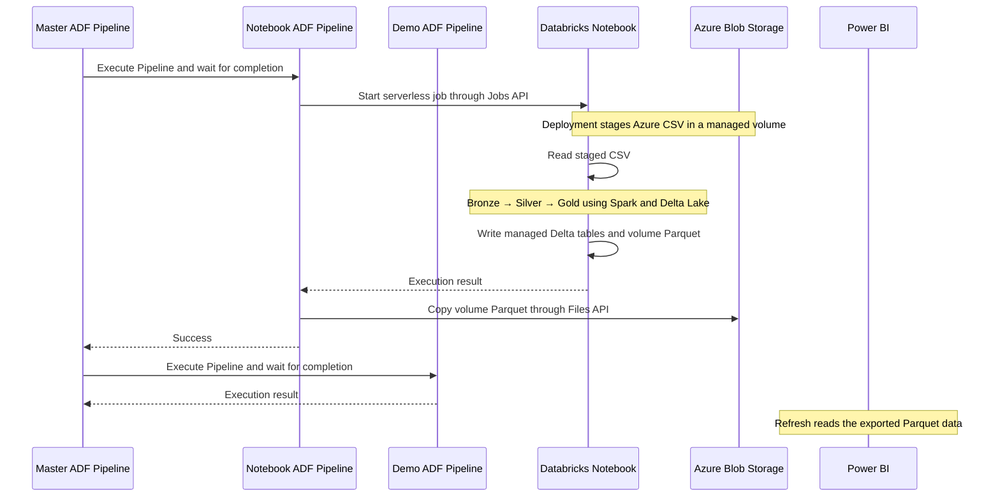

# azure-databricks-analyst-bootcamp

> A hands-on Medallion-architecture bootcamp repo that takes Data Analysts from raw Azure Blob data to Power BI dashboards, using Databricks Free Edition serverless jobs, Delta Lake, and Azure Data Factory.

---

## Table of Contents

- [azure-databricks-analyst-bootcamp](#azure-databricks-analyst-bootcamp)
  - [Table of Contents](#table-of-contents)
  - [Overview](#overview)
  - [Architecture](#architecture)
  - [Orchestration Flow](#orchestration-flow)
  - [Tech Stack](#tech-stack)
  - [Setup and Run from Your Local Machine](#setup-and-run-from-your-local-machine)
    - [1. Prepare the environment](#1-prepare-the-environment)
    - [2. Configure `.env`](#2-configure-env)
    - [3. Provision and deploy](#3-provision-and-deploy)
    - [4. Execute online](#4-execute-online)
    - [5. Format and check deployment code](#5-format-and-check-deployment-code)
    - [6. Clean up Azure resources](#6-clean-up-azure-resources)
  - [Free Edition data flow](#free-edition-data-flow)
  - [Where the data lives](#where-the-data-lives)
  - [Load the report into Power BI](#load-the-report-into-power-bi)

---

## Overview

This repository is an end-to-end analytics example for Data Analysts learning the Azure + Databricks ecosystem.

**Pipeline in one sentence:** raw files land in **Azure Blob Storage**, get transformed through a **Bronze → Silver → Gold** Medallion architecture on **Databricks (Spark, Delta Lake)**, the whole thing is orchestrated by **Azure Data Factory (ADF)**, and the Gold layer is exported back to **Blob Storage as Parquet** for **Power BI** to consume as the final BI layer.

Students develop, execute, and test notebooks **online in the Databricks workspace**. Local Python commands handle infrastructure setup and deployment.

---

## Architecture


| Folder | Responsibility |
|---|---|
| `azure-terraform-provisioner/` | Azure infrastructure managed by Terraform and automated through Python |
| `azure-data-factory-pipeline/` | Complete Python pipeline definitions in `src/adf/defs/` (one file per pipeline), with shared connection and deployment helpers |
| `databricks-etl-pipeline/` | Dummy source data, SQL-based PySpark notebooks and shared write utilities under `src/notebooks/` |
| `powerbi-business-report/` | Power BI reporting layer consuming the exported Parquet data |

See [adding pipeline definitions](azure-data-factory-pipeline/README.md#add-a-notebook-pipeline): add notebooks and one `pl_*.py` file, then deploy. Pipeline discovery and Databricks job creation are automatic.

---

## Orchestration Flow



---

## Tech Stack

| Concern | Technology |
|---|---|
| Infrastructure | Azure Storage and Data Factory provisioned with Terraform through Python |
| Source storage | Azure Blob Storage / ADLS Gen2 |
| Compute / transform | Databricks Free Edition serverless jobs (PySpark notebooks) |
| Storage format | Delta Lake (Bronze/Silver/Gold) |
| Orchestration | Azure Data Factory, configured with Python |
| BI export format | Parquet (Blob Storage) |
| BI / reporting | Power BI |
| Configuration | Essential inputs in root `.env`; defaults in `config.py` |
| Formatting | Prek and Ruff, configured at the repository root |
| CI | GitHub Actions |

---

## Setup and Run from Your Local Machine

### 1. Prepare the environment

Install **Python 3.12** and **[uv](https://docs.astral.sh/uv/getting-started/installation/)**. From the repository root:

```bash
uv sync --locked
cp .env.example .env
```

On PowerShell, use `Copy-Item .env.example .env`. Preserve an existing `.env` when updating the repository.

Spark and Delta Lake run in Databricks; local Java and Spark installations are not required. Terraform is downloaded and verified automatically by the provisioning command.

### 2. Configure `.env`

Use [.env.example](.env.example) as the configuration reference. For Azure permissions and step-by-step setup, follow [AZURE.md](AZURE.md). Fill in these values:

| Variable | Description |
|---|---|
| `AZURE_SUBSCRIPTION_ID` | Azure subscription ID |
| `AZURE_TENANT_ID` | Microsoft Entra tenant ID |
| `AZURE_CLIENT_ID` | Deployment service principal's application/client ID |
| `AZURE_CLIENT_SECRET` | Deployment service principal's secret |
| `STORAGE_ACCOUNT` | Globally unique storage account name: 3-24 lowercase letters/numbers |
| `DATA_FACTORY` | Globally unique Data Factory name |
| `DATABRICKS_HOST` | Full HTTPS URL from your Free Edition workspace browser |
| `DATABRICKS_TOKEN` | Workspace access token used to deploy notebooks and the job |

Set `DATABRICKS_NOTEBOOK_PATH` to a workspace folder such as `/Shared/analytics-demo`. Region, resource group, catalog/schema/volume, table prefix, and timeouts are configured in [config.py](azure-terraform-provisioner/src/provisioner/config.py). Job names and notebook paths are declared in each ADF definition; generated job IDs are supplied automatically during deployment.

The Azure service principal needs Contributor access. The local provisioner and ADF use the storage account key; notebooks use managed Databricks storage and need no Azure credentials. ADF stores storage credentials in secure linked-service fields.

Free Edition supports serverless compute only. The deployed job leaves cluster settings out so it runs on serverless. Its fair usage limits apply, including the account's job concurrency quota. See [Free Edition limits](https://learn.microsoft.com/en-us/azure/databricks/getting-started/free-edition-limitations).


### 3. Provision and deploy

First provision the Azure storage and Data Factory resources:

```bash
uv run solution provision
```

The command does not create a Databricks workspace. Use your existing Free Edition workspace URL in `DATABRICKS_HOST` and add its token to `DATABRICKS_TOKEN`, then deploy:

```bash
uv run solution deploy
```

Deployment discovers `pl_*.py` files under `azure-data-factory-pipeline/src/adf/defs/`, validates their notebook paths, uploads every notebook and utility beneath `DATABRICKS_NOTEBOOK_PATH`, and creates or updates all declared serverless Databricks jobs. It passes their generated IDs directly into ADF and deploys all discovered pipelines. It also uploads and stages the ten-row course sales fixture. ADF Web activities start and poll jobs because the Azure Databricks Job activity rejects Free Edition workspace URLs.

The Azure Storage account and Data Factory can incur Azure charges. Free Edition job execution uses Databricks serverless quotas.

For later infrastructure changes and deployment together, `uv run solution setup` requires the Databricks host and token already configured. Terraform retains its state under `azure-terraform-provisioner/`; use that same configuration to clean up resources.


### 4. Execute online

Open the Databricks workspace and a notebook inside the folder configured by `DATABRICKS_NOTEBOOK_PATH`. Select **Serverless** compute, then **Run All**. The executing student account needs permission to read the notebook and utility file, use serverless compute, and read/write the managed volume and tables. The deployment identity needs permission to create a volume and tables in the configured schema (default: `workspace.default`).

The source notebook is maintained in `databricks-etl-pipeline/src/notebooks/`. Its cells use `spark.sql` and temporary views for the transformations, then check the resulting tables and Parquet output inside Databricks. The adjacent `utils.py` provides parameter setup and `write_data(frame, target, format="delta")` for managed tables; use `format="parquet"` for reporting exports. Deployment uploads this as a regular Python file beside the notebook so `from utils import setup_parameters, write_data` works. See [Databricks module imports](https://learn.microsoft.com/en-us/azure/databricks/files/workspace-modules).

To start the master ADF pipeline (the sales child runs its serverless Databricks job, then the dummy child runs on success):

```bash
uv run solution run-adf
```

Monitor execution in ADF Studio or inspect the returned run ID:

```bash
uv run solution status YOUR_RUN_ID
```

Run interactive notebook sessions and ADF executions sequentially because they write the same demo datasets. Stopping the local monitoring command does not cancel a remote run; inspect or cancel it in the workspace or ADF Studio.

### 5. Format and check deployment code

```bash
uv run prek install
uv run prek run --all-files
uv run pytest
```

Prek runs Ruff lint fixes and then `ruff format`, using the root `pyproject.toml`. For newly created, untracked files, use `uv run prek run --files path/to/file.py`. The small provisioning tests do not start Spark or contact Azure; students validate transformations in the Databricks notebook.

### 6. Clean up Azure resources

Use the exact `resource_group` from `config.py`:

```bash
uv run solution cleanup --confirm-resource-group YOUR_RESOURCE_GROUP
```

Cleanup verifies the group against Terraform state before destroying its managed resources, including stored demo data.

## Free Edition data flow

Deployment uploads the ten-row fixture to Azure, then stages a snapshot in a Databricks managed volume. ADF runs reuse that snapshot. Redeploy to refresh the course data. Bronze/Silver/Gold are managed Delta tables; the Azure `lakehouse` container is retained but unused by this workflow.

Manual notebook execution writes Parquet into the volume. Run `uv run solution run-adf` to also copy the report to Azure. The single-file export is intended for the ten-row example. Azure cleanup leaves Databricks jobs, notebooks, managed tables, and volumes; remove these separately in the workspace and Catalog Explorer.

## Where the data lives

These are the default locations from [config.py](azure-terraform-provisioner/src/provisioner/config.py) and [ADF connections](azure-data-factory-pipeline/src/adf/connections.py). Replace `<STORAGE_ACCOUNT>` with the value in the root `.env`.

| Data | Location | Written by |
|---|---|---|
| Source fixture | Azure `raw/sales/sales.csv` | Local deployer, from `databricks-etl-pipeline/data/sales.csv` |
| Staged source | `/Volumes/workspace/default/analytics_demo/raw/sales.csv` | Local deployer, downloaded from Azure |
| Bronze table | `workspace.default.analytics_demo_sales_bronze` | Notebook: ten source rows as strings |
| Silver table | `workspace.default.analytics_demo_sales_silver` | Notebook: cleaned and typed rows with revenue |
| Gold table | `workspace.default.analytics_demo_sales_gold` | Notebook: totals grouped by date and category |
| Volume report | `/Volumes/workspace/default/analytics_demo/reports/sales/report.parquet` | Notebook: single Parquet file with Gold results |
| Azure report | `https://<STORAGE_ACCOUNT>.blob.core.windows.net/reports/sales/report.parquet` | ADF Copy activity after the job succeeds |
| Azure `lakehouse` container | Created but unused | No current writer |

The Azure account has hierarchical namespace enabled (ADLS Gen2). The export uses its Blob endpoint. The managed Delta tables reside in Databricks-managed storage; creating an Azure container named `lakehouse` does not connect those tables to it. This container is also unrelated to a Microsoft Fabric Lakehouse.

ADF acts as the transfer client: it downloads the volume file using the Databricks Files API and writes its bytes into Blob Storage using the storage account key. The notebook does not need Azure credentials or a direct outbound connection to Azure. See the [ADF execution and export walkthrough](azure-data-factory-pipeline/README.md#how-the-sales-export-works) for activities, authentication, and failure diagnosis.

The [Microsoft ADLS Python guide](https://learn.microsoft.com/en-us/azure/storage/blobs/data-lake-storage-directory-file-acl-python) describes a different option: directly upload files with `DataLakeServiceClient`. That SDK path is not implemented here, and uploading a Parquet file does not create a Delta transaction log.

Reruns overwrite the demo tables and report locations. They do not keep historical snapshots. ADF runs read the staged CSV, so editing only the Azure CSV does not change the next job's input. To change the fixture, edit the repository CSV and redeploy; update the notebook's fixed row-count and total assertions if the dataset changes. Deployment overwrites the Azure CSV with the repository fixture.

## Load the report into Power BI

After `uv run solution run-adf` succeeds, connect Power BI Desktop to the Azure report above. Power BI reads the two-row summary, not the ten-row source or the managed Delta tables.

Follow the [Power BI guide](powerbi-business-report/README.md) for the complete procedure: confirm the blob exists, connect and authenticate, set column types, create measures and visuals, publish, and refresh. The expected totals are **10 sales, 55 units, and 550.00 revenue**.

ADF does not publish or refresh Power BI. Refresh the semantic model after the Azure copy succeeds. No Power BI report is deployed by the Python commands.
