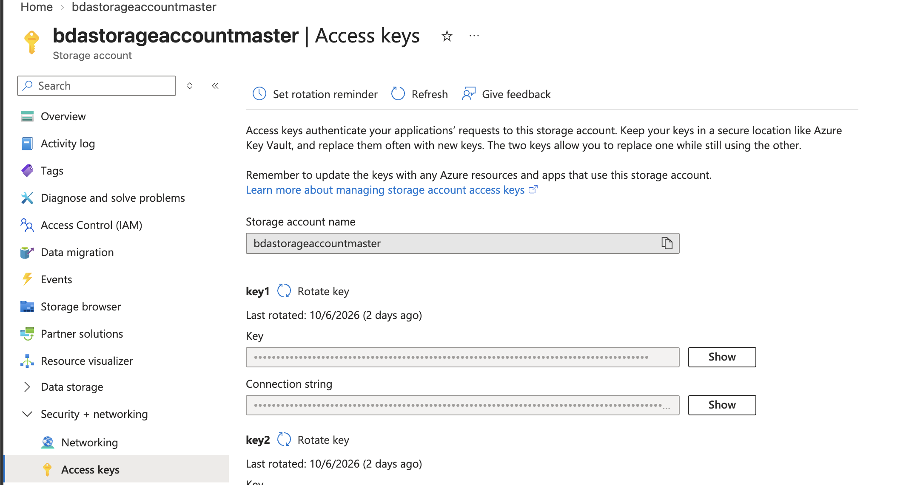
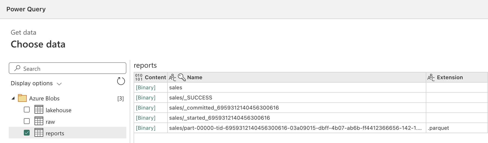
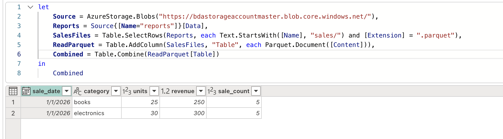

# Sales report in Power BI

Run the deployed sales notebook on Azure Databricks serverless, manually or through ADF. It writes Delta tables to `lakehouse/dm_sales/` and Parquet part files to `reports/sales/` directly.

## Connect

Preferred: **Get data → Azure Databricks**. Copy your SQL warehouse's server hostname and HTTP path from Databricks connection details. Authenticate, select `<catalog>.dm_sales.analytics_demo_sales_gold`, and rename the query `SalesReport`.

Alternatively, load the Parquet files directly from Azure Blob Storage, as described below.

### Load Parquet from Azure Blob Storage

The output is a Spark directory (`sales/`), not a fixed `report.parquet` file, so filter to its `.parquet` part files and combine them. Use the storage account key for this connector, not the Databricks PAT.

1. In the Azure portal, open your storage account → **Security + networking → Access keys**, and copy **key1**'s Key.

   

2. In Power BI Desktop, select **Get data → Azure Blob Storage**, enter the storage account name, and paste the account key when asked. Check the `reports` container and select **Transform Data**. `_SUCCESS` and `_committed_*`/`_started_*` metadata files are listed beside the `.parquet` part file.

   

3. Open **Advanced Editor**, replace the query with the following (use your account's URL), and rename the query `SalesReport`:

   ```powerquery
   let
       Source = AzureStorage.Blobs("https://<storage-account>.blob.core.windows.net/"),
       Reports = Source{[Name="reports"]}[Data],
       SalesFiles = Table.SelectRows(Reports, each Text.StartsWith([Name], "sales/") and [Extension] = ".parquet"),
       ReadParquet = Table.AddColumn(SalesFiles, "Table", each Parquet.Document([Content])),
       Combined = Table.Combine(ReadParquet[Table])
   in
       Combined
   ```

   

## 3. Check columns and expected results

In Power Query, confirm the following types, then select **Close & Apply**:

| Column | Power BI type | Meaning |
|---|---|---|
| `sale_date` | Date | Date shared by the sales in this group |
| `category` | Text | Cleaned, lowercase category |
| `units` | Whole number | Sum of quantities |
| `revenue` | Fixed decimal number | Sum of quantity × unit price |
| `sale_count` | Whole number | Number of source sales in the group |

The unchanged repository fixture produces:

| sale_date | category | units | revenue | sale_count |
|---|---|---:|---:|---:|
| 2026-01-01 | books | 25 | 250.00 | 5 |
| 2026-01-01 | electronics | 30 | 300.00 | 5 |
| **Total** | | **55** | **550.00** | **10** |

Row order is not significant. This export has one row per date and category, so it contains **two rows**, representing **ten sales**. Product and individual sale IDs are not present. No relationships or date table are needed for this single-date exercise.

## 4. Create measures and visuals

Select **New measure** and create each measure separately:

```dax
Total Revenue = SUM(SalesReport[revenue])
```

```dax
Total Units = SUM(SalesReport[units])
```

```dax
Total Sales = SUM(SalesReport[sale_count])
```

```dax
Revenue per Sale = DIVIDE([Total Revenue], [Total Sales])
```

Use `Total Sales`, not `COUNTROWS(SalesReport)`, to count original sales. Format revenue measures with two decimal places; the fixture does not specify a currency.

Build a first report page with:

- Three cards for `Total Revenue`, `Total Units`, and `Total Sales`.
- A column chart with `category` on the horizontal axis and `Total Revenue` as its value.
- A table with `sale_date`, `category`, and the three totals.
- A category slicer to demonstrate filtering.

With no filters, the cards should show **550.00**, **55**, and **10**, and `Revenue per Sale` should be **55.00**. Selecting `books` should show **250.00**, **25**, and **5**. Save the report as `sales-report.pbix` in your chosen local location.

## Refresh

Publish from Power BI Desktop, configure the semantic model connection credentials in Power BI service, then refresh after a successful notebook/ADF run. ADF does not automatically refresh Power BI.

For the WHO star schema and analysis examples, see [DEMO.md](../DEMO.md).
